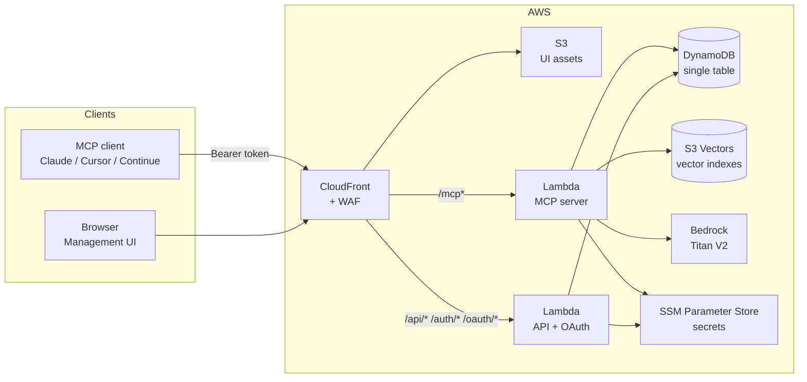
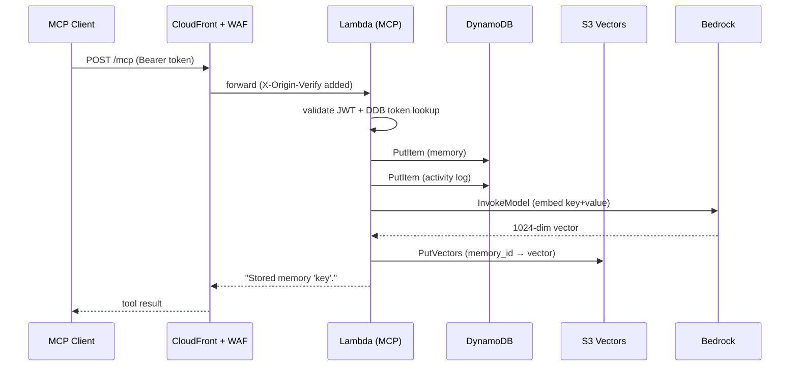
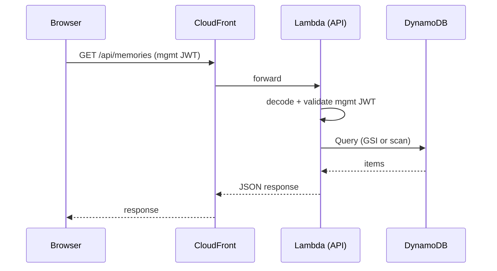
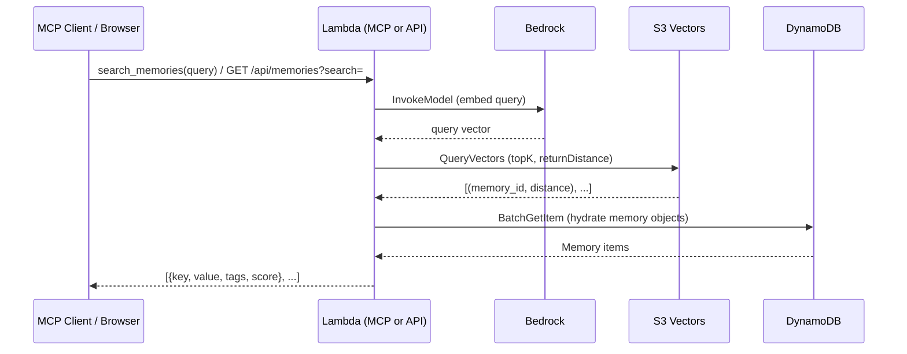
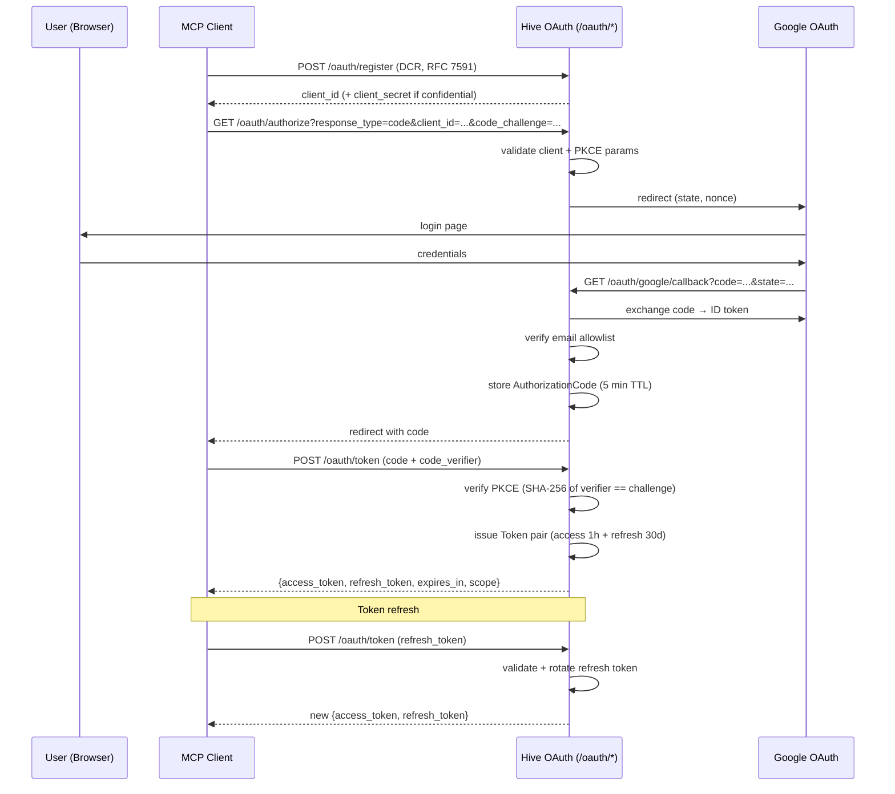
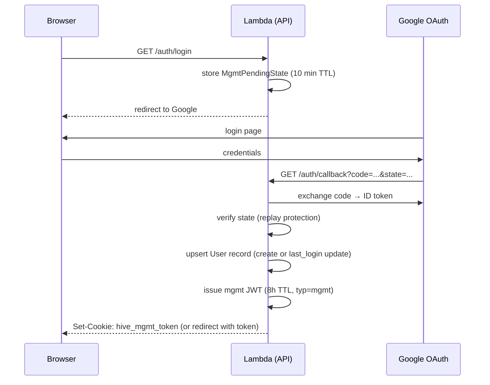
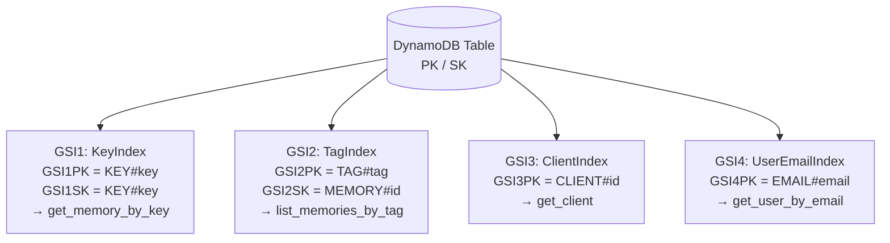
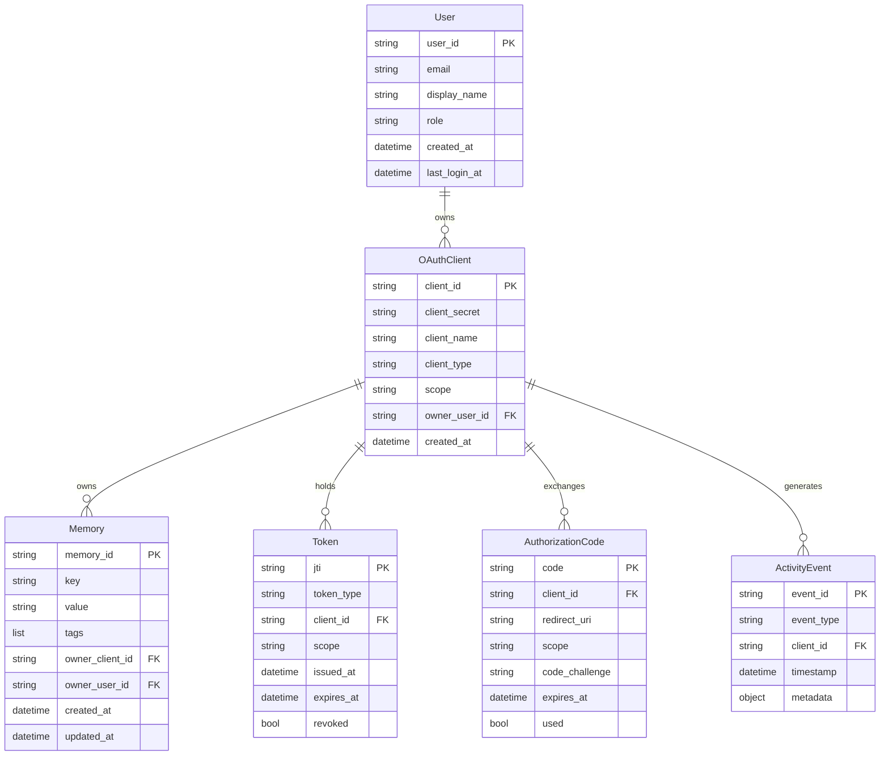
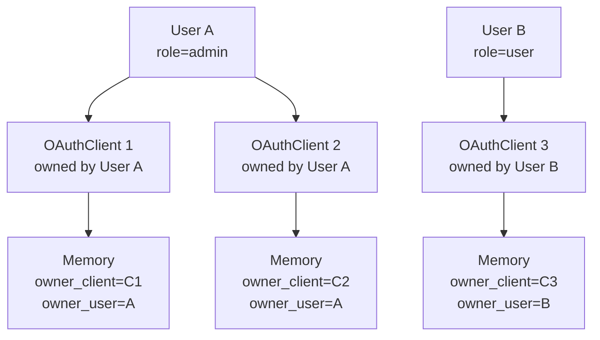

# Hive — System Architecture

Internal/contributor reference. Not part of the customer-facing docs site.

---

## Table of contents

1. [High-level overview](#high-level-overview)
2. [AWS infrastructure](#aws-infrastructure)
3. [Request flows](#request-flows)
4. [OAuth 2.1 / PKCE flow](#oauth-21--pkce-flow)
5. [DynamoDB single-table design](#dynamodb-single-table-design)
6. [Semantic search (S3 Vectors)](#semantic-search-s3-vectors)
7. [Multi-tenancy model](#multi-tenancy-model)
8. [Security layers](#security-layers)

---

## High-level overview

Hive exposes two Lambda-backed surfaces behind a single CloudFront distribution:

| Surface | Path prefix | Lambda handler |
| --- | --- | --- |
| MCP server (FastMCP) | `/mcp*` | `hive.server.lambda_handler` |
| Management API (FastAPI) + OAuth | `/api/*`, `/auth/*`, `/oauth/*`, `/.well-known/*` | `hive.api.main.lambda_handler` |
| Management UI (React SPA) | everything else | S3 → CloudFront (static) |



---

## AWS infrastructure

### CloudFront + WAF

- Single distribution fronts both Lambdas and the S3 UI bucket
- **Cache behaviours** (evaluated in order):
  - `/api/*`, `/auth/*`, `/oauth/*`, `/.well-known/*`, `/mcp*`, `/health` → `CachingDisabled` (no-cache), forwarded to respective Lambda Function URL
  - `default` → `CachingOptimized` (UI assets from S3)
- **WAF** (prod only): OWASP Top 10 + known bad inputs managed rule groups; rate limiting — 100 req/5 min per IP on `/oauth/*`, 1000 req/5 min globally
- **Origin verify**: Lambda rejects requests missing `X-Origin-Verify` header (value stored in SSM), preventing direct Lambda URL access

### Lambda functions

Both functions:
- Python 3.12, 512 MB, 30 s timeout
- Function URL with `auth=NONE` (CloudFront handles auth at the edge)
- X-Ray active tracing
- Environment variables injected by CDK: table name, SSM param paths, bucket names, issuer URL, app version

### DynamoDB

- Single table, `PAY_PER_REQUEST` billing
- 4 Global Secondary Indexes (see [DynamoDB design](#dynamodb-single-table-design))
- TTL on `ttl` attribute (auth codes, tokens, pending state)
- Point-in-time recovery enabled in prod

### S3 Vectors

- One bucket per environment (`hive-vectors` / `hive-vectors-{env}`)
- One index per OAuth client (`client-{client_id}`), lazy-created on first `remember()` call
- Bedrock Titan Embeddings V2 (`amazon.titan-embed-text-v2:0`): 1024 dims, cosine distance, normalised vectors

### KMS, SSM, CloudWatch

- Customer-managed KMS keys for DynamoDB, S3, and CloudWatch Logs (prod)
- Secrets in SSM Parameter Store: JWT secret, Google OAuth credentials, email allowlist, origin-verify secret
- CloudWatch dashboard + alarms (error rate, P99 latency, DynamoDB throttles, CloudFront 5xx)

---

## Request flows

### MCP tool call (e.g. `remember`)



### Management UI request



### Semantic search



---

## OAuth 2.1 / PKCE flow

Hive implements a full OAuth 2.1 authorization server. MCP clients use the standard authorization code + PKCE flow; the management UI uses a parallel Google-backed flow.

### MCP client authorization (authorization code + PKCE)



### Management UI login (Google → mgmt JWT)



---

## DynamoDB single-table design

All entities share one table. The entity type is encoded in the PK prefix.

### Access patterns and key schema

| Entity | PK | SK | GSI | TTL |
| --- | --- | --- | --- | --- |
| Memory (meta) | `MEMORY#{memory_id}` | `META` | GSI1: `KEY#{key}` / `KEY#{key}` | — |
| Memory (tag) | `MEMORY#{memory_id}` | `TAG#{tag}` | GSI2: `TAG#{tag}` / `MEMORY#{memory_id}` | — |
| OAuth Client | `CLIENT#{client_id}` | `META` | GSI3: `CLIENT#{client_id}` | — |
| Token | `TOKEN#{jti}` | `META` | — | ✓ (1h access / 30d refresh) |
| Authorization Code | `AUTHCODE#{code}` | `META` | — | ✓ (5 min) |
| Pending Auth (PKCE) | `PENDING#{state}` | `META` | — | ✓ (10 min) |
| User | `USER#{user_id}` | `META` | GSI4: `EMAIL#{email}` | — |
| Mgmt Pending State | `MGMT_STATE#{state}` | `META` | — | ✓ (10 min) |
| Activity Log | `LOG#{date}#{hour}` | `{timestamp}#{event_id}` | — | — |

Activity log is hour-sharded (24 partitions per day) to avoid hot partitions on high-write workloads.

### Global Secondary Indexes



### Entity relationships



---

## Semantic search (S3 Vectors)

### Architecture

- **Dual-write**: every `remember()` write goes to DynamoDB first (authoritative), then vectors are written to S3 Vectors best-effort (failure logged, never propagated to caller)
- **One index per client**: index name `client-{client_id}`, lazy-created on first write via `CreateIndex` (swallows `ConflictException` if already exists)
- **Embedding model**: Bedrock Titan Text Embeddings V2 (`amazon.titan-embed-text-v2:0`), 1024 dimensions, cosine distance, normalised
- **Indexed text**: `"{key}: {value}"` — including the key gives richer semantic coverage

### Score calculation

```
score = 1.0 - cosine_distance   (range 0.0–1.0, higher = more relevant)
```

### Resilience

| Operation | Failure behaviour |
| --- | --- |
| `upsert_memory` | Exception caught + logged; DynamoDB write already succeeded |
| `delete_memory` | Exception caught + logged; DynamoDB delete already succeeded |
| `search` | `VectorIndexNotFoundError` if client has no index yet → caller returns empty results |

---

## Multi-tenancy model



### Access rules

| Actor | Scope | Can see |
| --- | --- | --- |
| MCP client token | `memories:read` / `memories:write` | Only memories created by that `client_id` |
| Mgmt UI (role=user) | — | Only memories where `owner_user_id == sub` |
| Mgmt UI (role=admin) | — | All memories across all users |

Memories written by an MCP client set `owner_client_id` to the token's `client_id`. If the same user authorises multiple clients, memories are isolated per client unless the user queries via the management UI (which aggregates by `owner_user_id`).

---

## Security layers

| Layer | Mechanism |
| --- | --- |
| Network edge | WAF (OWASP, rate limiting) on CloudFront (prod) |
| Origin protection | `X-Origin-Verify` header — Lambda rejects requests not from CloudFront |
| MCP authentication | OAuth 2.1 Bearer JWT, validated per request against DynamoDB (revocation check) |
| Management UI authentication | Google OAuth → mgmt JWT (`typ=mgmt`, 8h TTL) |
| PKCE | Required on all authorization code flows; SHA-256 challenge/verifier |
| Least-privilege IAM | Lambda roles scoped to specific DynamoDB table, SSM params, S3 Vectors bucket |
| Secrets management | JWT secret + Google credentials in SSM Parameter Store; never in env vars for prod |
| Token lifecycle | Access: 1h, Refresh: 30d, Auth Code: 5m — all with DDB revocation support |
